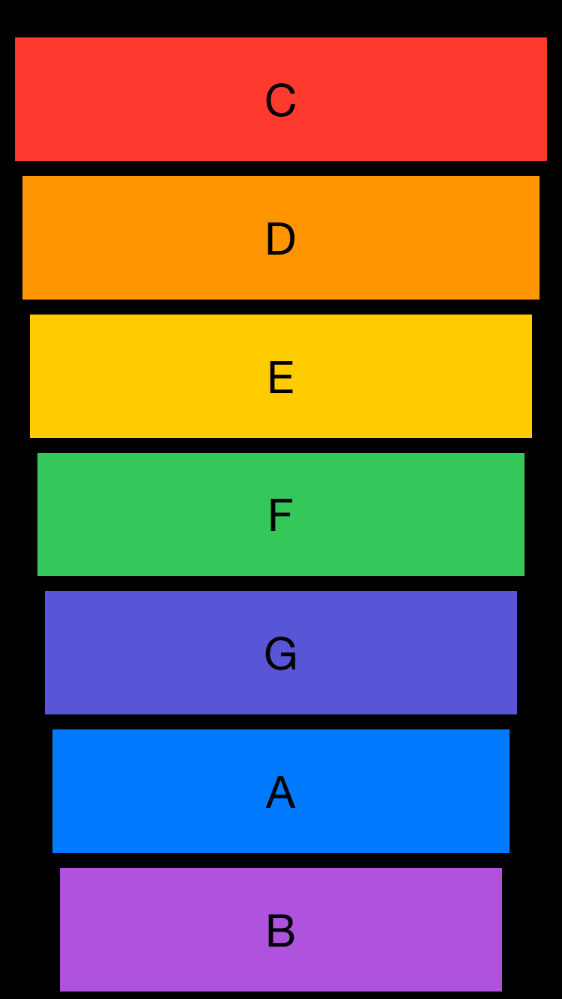

#  Xylophone
    This application is included in TheAppBrewery's iOS Application Development Bootcamp.
An iOS Application which plays sound when specific button is tapped.

## Technologies
<a href="https://developer.apple.com/documentation/uikit"> UIKit </a> - Construct and manage a graphical, event-driven user interface for your iOS or tvOS app.
- <a href="https://developer.apple.com/documentation/uikit/uibutton"> UIButton </a> - A control that executes your custom code in response to user interactions.

<a href="https://developer.apple.com/documentation/avfoundation"> AVFoundation </a> - Work with audiovisual assets, control device cameras, process audio, and configure system audio interactions.
- <a href="https://developer.apple.com/documentation/avfoundation/avaudioplayer"> AVAudioPlayer </a> - An audio player that provides playback of audio data from a file or memory.

<a href="https://developer.apple.com/documentation/dispatch/dispatchqueue"> DispatchQueue </a> - An object that manages the execution of tasks serially or concurrently on your app's main thread or on a background thread.

## Screenshot

